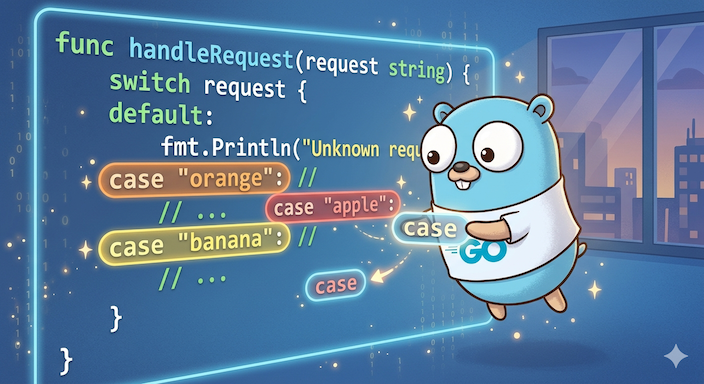

<p align="center">
  
</p>

# switch-order

A Go linter that enforces consistent ordering of `switch` case statements — alphabetically for strings, numerically for integers and floats.

## What it catches

```go
// Bad — cases are out of order
switch fruit {
case "orange":
    // ...
case "apple": // case "apple" should come before "orange"
    // ...
case "banana": // case "banana" should come before "orange"
    // ...
}

// Good
switch fruit {
case "apple":
    // ...
case "banana":
    // ...
case "orange":
    // ...
}
```

It also handles integers, floats, hex literals, negative numbers, multi-value cases, and `fallthrough` chains.

## Installation

```sh
go install github.com/JoachAnts/switch-order/cmd/switchorder@latest
```

## Usage

### Standalone

```sh
switchorder ./...
```

### golangci-lint

Add to your `.golangci.yml`:

```yaml
linters:
  enable:
    - switchorder

linters-settings:
  custom:
    switchorder:
      path: switchorder.so
      description: Enforces ordered switch case statements
      original-url: github.com/JoachAnts/switch-order
      settings:
        order: asc
        comparators:
          - type: numeric
          - type: alphabetical
            ignore-case: true
        default-last: true
        autofix:
          enabled: true
          allow-fallthrough: false
```

## Configuration

| Option | Type | Default | Description |
|--------|------|---------|-------------|
| `order` | `string` | `asc` | Sort order: `asc` or `desc` |
| `comparators` | `list` | numeric, alphabetical | Comparators applied in priority order |
| `comparators[].type` | `string` | — | `numeric` or `alphabetical` |
| `comparators[].ignore-case` | `bool` | `true` | Case-insensitive string comparison (alphabetical only) |
| `default-last` | `bool` | `true` | Always place the `default` case last |
| `autofix.enabled` | `bool` | `true` | Emit suggested fixes |
| `autofix.allow-fallthrough` | `bool` | `false` | Suggest fixes for switches that contain `fallthrough` |

### CLI flags

All options are also available as flags when using the standalone binary:

```sh
switchorder -order=asc -ignore-case -default-last -autofix -autofix-allow-fallthrough ./...
```

## Features

### Numeric ordering

Integers, floats, hex literals, and negative numbers are compared by value:

```go
// Bad
switch code {
case 0xFF:
case 0x0A: // out of order
case -1:   // out of order
}

// Good
switch code {
case -1:
case 0x0A:
case 0xFF:
}
```

### Multi-value cases

Values within a single `case` clause are sorted too:

```go
// Bad
case 3, 1, 2:

// Good
case 1, 2, 3:
```

### Fallthrough groups

Cases connected by `fallthrough` are treated as a single unit and sorted together, preserving their internal order:

```go
// Bad
switch x {
case "zebra":
    fallthrough
case "yacht":
    fallthrough
case "venus":
case "apple": // out of order relative to the "zebra" group
}

// Good
switch x {
case "apple":
case "zebra":
    fallthrough
case "yacht":
    fallthrough
case "venus":
}
```

By default, suggested fixes are not emitted for switches containing `fallthrough` (set `autofix.allow-fallthrough: true` to enable).

## License

MIT
